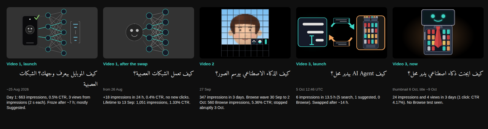

# The channel's data so far (snapshot: 9 Oct 2026)

Self-contained, so video 4 can be planned without the sibling repos attached. Newer reads live in `../ai-agents-explainer/docs/video3_analytics.md` and `../ai-image-explainer/docs/video2_analytics.md` when those are around; otherwise **ask Ali for the latest Studio numbers** (the reads still to come are in §8).

How to read it: every number is either **as Studio reported it** (screenshots, or read out by YouTube's built-in assistant, whose figures matched Ali's screenshots), **derived** by arithmetic (marked), or **unknown**. Hypotheses are labelled as such and are never used as facts.

## 1. The three videos side by side

| | Video 1 | Video 2 | Video 3 |
|---|---|---|---|
| Topic | How neural nets work (Face ID as bookend) | How chat apps write pictures (visual tokens) | How AI agents work, through an AI-run shop |
| Title now (Studio id) | «كيف بتشتغل الشبكات العصبية؟ أساس الذكاء الاصطناعي» (gB0a33ZZYmE) | «كيف الذكاء الاصطناعي بيرسم الصور؟» (C-31-hB0-cY) | «كيف ايجنت ذكاء اصطناعي يدير محل؟» (HygDWiw5PS0); first «كيف AI Agent بيدير محل؟» |
| Latin letters in the title | none | none | at first; none since ~9 Oct |
| Length | 14:24 | 3:48 | 5:54 |
| Published | ~25 Aug 2026 | Sun 27 Sep 2026 (time of day: check Studio) | Mon 5 Oct 2026, 12:46 UTC (15:46 Syria); not scheduled |
| Thumbnail | phone + net (launch), then a net filling the frame | a half-written face, no text | the loop picture, then candidate c (the shop fridge with a face on its screen, red tie) from 6 Oct |
| Impressions | 663 on day 1; 1,051 lifetime (to 13 Sep) | 347 in 3 days; just over 800 by 8 Oct | 24 in 3 days |
| Views | ~80 lifetime: ~66 friends/direct, ~14 impression clicks | 36 in 3 days; ~106 by 8 Oct | 4 in 3 days |
| Where impressions came from | mostly Suggested (678 of ~681) | Browse 560, Suggested 172, Search ~81 | not split; first 13.5 h: 5 search, 1 suggested |
| CTR | 0.4–0.8% day 1; 1.33% lifetime | 3.17% (3 days); 5.36% on Browse; 0% on Suggested | 4.17% = 1 click of 24 |
| Average % viewed | ~7.5% per raw view (1:05); friends 14.8% (2:08) | 36.5% (3 days), ~30% (6 days) | 53.4% over 4 views |
| What happened | one failed first test, then frozen | one Browse test (a 3-day wave), then an abrupt stop | no Browse test seen |

## 2. Timeline

| Date | Event |
|---|---|
| ~25 Aug | Video 1 published with «كيف الموبايل بيعرف وجهك؟ الشبكات العصبية» and a phone + net thumbnail (C2) |
| 26 Aug | Swapped to «كيف تعمل الشبكات العصبية؟» and a net-fills-the-frame thumbnail (C1); no new wave followed |
| 13 Sep | Video 1's analytics closed: 1,051 impressions lifetime, 1.33% CTR (≈ 14 clicks), ~13 impressions a day |
| 8–14 Sep | Video 2's topic locked, then re-locked (image generation by visual tokens, replacing a photo-compression idea) |
| Sun 27 Sep | Video 2 published |
| 29 Sep | Video 2 Read 1: 16 views, 222 impressions, 1.8% CTR |
| 30 Sep – 2 Oct | Video 2's Browse wave: ≈ 430 impressions and 65 views in 3 days |
| 1 Oct | Video 2 Read 2: 46 views, 431 impressions (the wave was still running; the chart's flat right edge was lag) |
| 3 Oct | Video 2: 10 impressions; 5–8 a day since. Video 3 built in one day (see `video3_handoff.md`) |
| Mon 5 Oct, 12:46 UTC | Video 3 published, not scheduled (the plan was Fri 9 Oct, 15:00 Syria) |
| 6 Oct | Video 3 Read 1: 6 impressions in 13.5 h (5 search, 1 suggested, 0 Browse). Thumbnail replaced by candidate c |
| ~8–9 Oct | Video 3's title changed to «كيف ايجنت ذكاء اصطناعي يدير محل؟». Video 3 Read 2 and video 2 Read 3 |
| Mon 12, Mon 19 Oct | Planned reads of video 3 (§8); no edits to it before the 19th |

## 3. Facts per video

### Video 1 (source: its launch notes and `image_plan.md` §1 in the video 2 repo)
- First ~15 h: 15 views (6–8 internal), overall CTR 0.5%, average view duration 3:01, which came from non-shelf viewers.
- Day-1 funnel (25 Aug): **663 impressions, 0.5% CTR, 3 views from impressions, averaging 0:02**. Impressions plateaued after ~7 h.
- 27 Aug, a day after the swap: 681 impressions (+18; 99.6% from YouTube recommendations), CTR 0.4%, still 3 views from impressions.
- **Suggested** (27 Aug): 678 impressions, 0.4% CTR, 4 views, average view duration 0:07. The few clicked "parent" videos were Arabic career, Excel and soft-skills videos: the wrong neighbourhood.
- Later (13 Sep): the last ~130 impressions under C1 clicked at ~5% (n = 7); impression-click viewers averaged ~0:41; friends averaged 2:08 (14.8% of 14:24); retention fell at 0:26, right after a spoken setup line («لحتى نفهم…»).
- Ali's diagnosis then: a failed first Suggested test froze impressions; swapping the packaging did not reopen the shelf.

### Video 2 (source: its analytics notes, Reads 1–3)
- **Read 1, 29 Sep:** 16 views, 222 impressions (73.4% from YouTube recommending), CTR 1.8%, average view duration 1:21–1:23 of 3:48 (≈ 36%). Views by source: Browse 7, Search 5, Channel pages 2, Suggested 1, External 1.
- **First hours (eyeballed from the cumulative chart, ±15):** ~180 impressions in the first ~4 h, then flat at ~110 a day; ~270 by day 2.8; the Browse wave began at day ~2.6.
- **Read 2, 1 Oct:** 46 views, 431 impressions, subscribers none gained; Browse 36 of the 46 views. No packaging change and no share between Reads 1 and 2 (Ali): the wave came from YouTube alone.
- **Read 3, 9 Oct (data through 8 Oct):**

| Window | Impressions | Views | CTR | Average % viewed |
|---|---|---|---|---|
| First 3 days (72 h) | 347 | 36 | 3.17% | 36.51% |
| 27 Sep – 2 Oct (first 6 days) | 777 | 101 | ~4.5% | ~30% |
| 3 Oct | 10 | 2 | 0.0% | 0.0% |
| 4 – 8 Oct | 5–8 a day | 0–3 a day | ~0% | low |
| Lifetime, to 8 Oct | just over 800 | ~106 | ~4.2% | not given |

| Source (lifetime to 8 Oct) | Impressions | Views | CTR |
|---|---|---|---|
| Browse features | 560 (68%) | 94 (88%) | 5.36% |
| Suggested videos | 172 | not given | 0% |
| YouTube search | ~81 | not given | not given |

- **Derived:** days 4–6 (≈ 30 Sep – 2 Oct) gave ≈ 430 of the 777 impressions and ≈ 65 of the 101 views; those later views averaged ≈ 26% of the video (≈ 1 minute) against 36.5% for the first 36. The wave **stopped abruptly** on 3 Oct; it did not taper.

### Video 3 (source: its analytics notes, Reads 1–2)
- **Read 1, 6 Oct, 13.5 h in:** 0 views, 6 impressions (5 search, 1 suggested, **0 Browse**), CTR 0 of 6.
- **Read 2, 9 Oct, first 3 days:** 24 impressions, 4 views, CTR 4.17% (= exactly 1 click of 24), average % viewed 53.42% (= ≈ 3:09 of 5:54, over 4 views). About 7 impressions a day: the level video 2 sits at after its wave.
- The 3 days mix packaging states: loop thumbnail + old title (first ~14 h), candidate c + old title (to ~8–9 Oct), then c + new title.
- **Not known:** the sources of the 24, the Search terms, whether the first-hour share reached anyone.

## 4. Patterns across the three (n = 3; observations, not laws)

1. **The first exposure shrinks with each upload:** 663 impressions on day 1 (video 1) → ~180 in the first 4 h and 222 by 1.9 days (video 2) → 6 in 13.5 h and 24 in 3 days (video 3). Consistent with the idea that YouTube sizes a new video's first exposure from the channel's recent record. **Unproven:** Ali suspects it; YouTube's assistant said each video is judged independently, with no data behind that either. If it is true, a strong video 4 matters more, and edits to video 3 won't revive it (video 1's lesson).
2. **Only video 2 got a Browse test**, and it was a strong one: 5.36% CTR on 560 impressions. It came after 2.6 quiet days and lasted ~3 days.
3. **The Suggested shelf gave nothing twice:** 0.4% of 678 (video 1), 0 clicks of 172 (video 2). The packaging works when the viewer is browsing (Home), not next to another video.
4. **Retention is decent for cold traffic:** video 2's wave viewers watched ≈ 1 minute of 3:48 on average. (An earlier note said ~25 s; that came from a lagging card and was wrong, see §5.)
5. **Packaging that worked once:** a plain «كيف الذكاء الاصطناعي …؟» question, no Latin letters, one face as the anchor, no text on the picture. Video 1 also had no Latin letters and a question title, but two-object, abstract diagram thumbnails; video 3 launched with Latin letters, an abstract diagram and a jargon word.
6. **Reach is lumpy and small:** video 2's "success" is ~106 views in 12 days. Scale expectations to that.

## 5. How to read Studio (method notes)

- **Lag:** the Overview watch-time card, impressions/CTR, the "unique viewers" figure and the right edge of any chart lag 1–3 days. On 1 Oct the card showed 0.4 h for 46 views while the processed average % viewed implied ≈ 1 h. Read retention from **average percentage viewed** and daily tables, and don't call a wave's shape from its last day.
- **Views run ≈ 3× the clicks that CTR × impressions imply** (video 2: 3.3× in the first 3 days, 3.1× lifetime and on Browse). CTR is understated relative to views; don't derive one from the other, and don't read the gap as shares.
- **The funnel panel** ("Impressions and how they led to watch time") covers fewer days than the headline numbers.
- **Judge CTR per source**, not the blended number: Browse, Suggested and Search behave differently.
- **A/B "Test & compare"** (title/thumbnail pairs, up to 3 variants, winner by watch time, needs Advanced features and desktop Studio) can't resolve at ~10 impressions a day.
- **YouTube's built-in assistant:** its numbers were reliable (video 2's first 3 days matched screenshots: 347 vs ~349 impressions, 36 vs ~37 views). Its explanations were generic and stated as fact without data; treat them as opinions.

## 6. Hypotheses to test (all unproven)

| # | Hypothesis | For | Against / unknown | What video 4 will show |
|---|---|---|---|---|
| H1 | A new video's first exposure is sized from the channel's recent record | the shrinking sequence in §4.1 | n = 3; the assistant said otherwise, unsupported | day-1 impressions of video 4 vs video 3's |
| H2 | Topic breadth: "how AI draws pictures" is something everyone has seen; "AI agent" is jargon (Ali: most people don't use agents) | video 2 vs 3 | one pair | a topic most people have heard of should get a test |
| H3 | Latin letters in the title hurt | video 2 vs 3 (Ali's working preference since 9 Oct) | video 1 had none and froze | n/a: keep Arabic-only and see |
| H4 | A face-like anchor in the thumbnail helps | video 2 (a face); video 3 c has one | c has had too few impressions | CTR by source if a test comes |
| H5 | Publish time matters | video 2 vs 3 differ (Sun, time unknown vs Mon 15:46 Syria) | unknown | publish at video 2's slot (check Studio) |
| H6 | The first-hour audience seeds the test | video 1's lesson | unknown what went out on video 3 | prepare the list before publishing |

## 7. Working agreements (what Ali has said)

- The channel is a **visual explainer of technical concepts**, Computerphile's balance (a little less technical), **not Al-Da7ee7 style**. Visuals matter most.
- **Timeless**: products are not the topic (at most one passing mention). A little history is welcome.
- Fun to explain and watch, in his words: **RL, the agent loop, protocols, context windows, how small tweaks change performance a lot, a bit of history.**
- Depth without math; he found video 2 shallow next to video 1. Roughly 6 minutes, Syrian dialect, no Pi creatures.
- **Packaging first**: title, thumbnail, hook, before building.
- Since 9 Oct he has removed the Latin letters from video 3's title because the successful video's title had none: **a working preference for titles, not a proven cause** (H3).
- He changes packaging when he regrets it. Recommended instead: no edits inside a read window.
- After video 3's slow start he stalled on video 4 and wants to restart with momentum.

## 8. Reads still to come (fill in, or ask Ali for the numbers)

- **Video 3, Mon 12 Oct (day 7):** impressions by source, Search terms (do they match the Arabic title?).
- **Video 3, Mon 19 Oct (day 14):** the verdict read. No edits to it before then.
- **Video 2, ~19 Oct:** baseline (5–8 impressions a day) after cards, a playlist and pinned comments point to video 3; also its publish time of day, lifetime watch time and average view duration, and Reach → Suggested videos (which videos showed it).
- Add each read to the respective analytics file and refresh §1 and §4 here.
